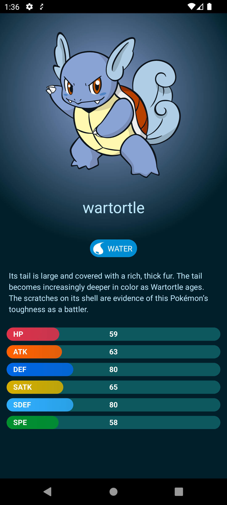

# 🚧 Under construction 👷‍♀️⛏👷🔧️👷🔧 🚧

<h1 align="center" style="margin-top: -40px">PokeQL</h1>

  
Feature based modular Pokedex app built with GraphQL, Jetpack Compose, Hilt, Paging 3, and more...

## Tech Stack

- [Compose](https://developer.android.com/jetpack/compose)
- [Compose Destinations](https://composedestinations.rafaelcosta.xyz/)
- [Navigation](https://developer.android.com/topic/libraries/architecture/navigation/)
- [Paging 3](https://developer.android.com/topic/libraries/architecture/paging/v3-overview)
- [Flow](https://developer.android.com/kotlin/flow)
- [Hilt](https://dagger.dev/hilt/)
- [OkHttp](https://square.github.io/okhttp/)
- [Apollo](https://www.apollographql.com/docs/kotlin/)
- [Material Design 3](https://developer.android.com/jetpack/compose/designsystems/material3)
- [Coil](https://coil-kt.github.io/coil/)
- [Lottie](https://airbnb.design/lottie/)

## Features

- [MVVM](https://en.wikipedia.org/wiki/Model%E2%80%93view%E2%80%93viewmodel)
- Feature based modularization
- [Clean Architecture](https://blog.cleancoder.com/uncle-bob/2012/08/13/the-clean-architecture.html)
- [Gradle Version Catalog](https://docs.gradle.org/current/userguide/platforms.html#sub:version-catalog)
- [Gradle Convention plugins](https://docs.gradle.org/current/samples/sample_sharing_convention_plugins_with_build_logic.html)
- Night mode support

## Screenshots

## Architecture

### Overview of a Feature Module

#### Shared Module

Kotlin module that contains the code for starting the feature module.
Usually the code consists of a communicator interface and a data class for the parameters.
The wiring module will bind them later so we can inject our communicator without knowing the
implementation details thanks to this dependency inversion practice.

#### Domain Module

Kotlin module that contains the business logic of the feature.
Usually it contains repository and use case interfaces. The actual implementation of them will be in
the data module.

#### Data Module

Android Library module that contains the implementation of the domain module.
Usually it contains repository and use case implementations.

#### UI Module

Android Library module that contains Screens, Viewmodels etc. of the feature.
This module contains the implementation of communicator interface that defined in the shared module.

#### Impl-Wiring Module

Android Library module that contains the dependency injection setup.

#### Fake Module

Android Library module that contains the mocked use case implementations and dummy datas.

#### Fake-Wiring Module

Android Library module that contains the dependency injection setup for the fake module.

#### Demo Module

Android Application Module that contains the demo app of the feature. Usually it consists of a
single activity that navigates to the feature module with mock datas.

### PokeQL Overview

